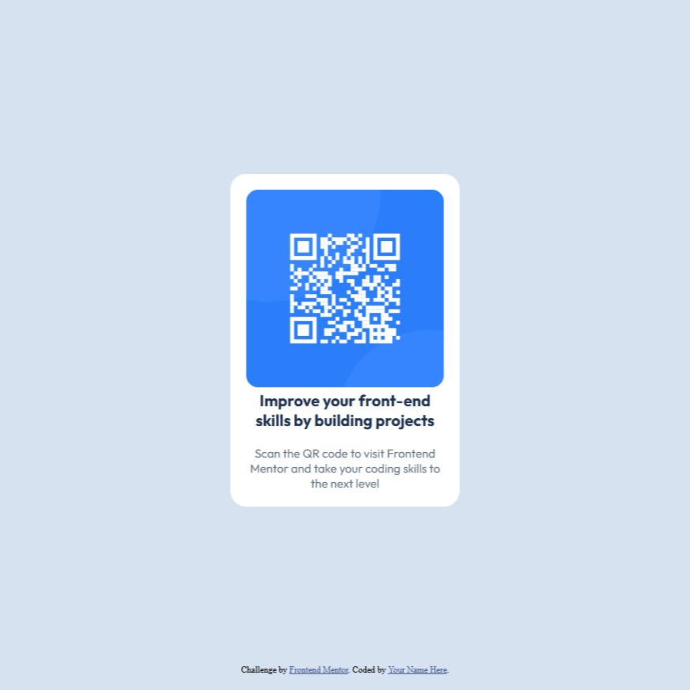

# Frontend Mentor - QR code component solution

This is a solution to the [QR code component challenge on Frontend Mentor](https://www.frontendmentor.io/challenges/qr-code-component-iux_sIO_H). Frontend Mentor challenges help you improve your coding skills by building realistic projects. 

## Table of contents

- [Overview](#overview)
  - [Screenshot](#screenshot)
  - [Links](#links)
- [My process](#my-process)
  - [Built with](#built-with)
  - [What I learned](#what-i-learned)
- [Author](#author)

**Note: Delete this note and update the table of contents based on what sections you keep.**

## Overview

### Screenshot

### Links

- Solution URL: [Watch my solution here](https://www.frontendmentor.io/solutions/qr-code-component-using-htmlcss-jSiZZiVR3B)
- Live Site URL: [Github pages](https://antooinepetit.github.io/QR-Code-Component/)

## My process

### Built with

- Semantic HTML5 markup
- CSS custom properties

### What I learned

I didn't really learn anything here, it's mostly stuff I already mastered a while ago, it was just to get a reminder.

## Author

- Website - [Antoine Petit](https://github.com/AntooinePetit)
- Frontend Mentor - [@AntoinePetit](https://www.frontendmentor.io/profile/AntooinePetit)
